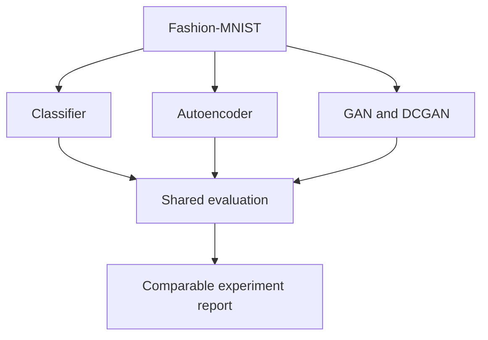

# Fashion Vision Lab

[](https://github.com/aminbakhtiari777/fashion-mnist-autoencoder/actions/workflows/ci.yml)
[](https://www.python.org/)
[](https://www.tensorflow.org/)
[](#experiments)

A compact computer-vision research portfolio connecting fashion-domain experience with four neural-network tasks: classification, representation learning, reconstruction, and generative modeling.

This repository consolidates earlier Fashion-MNIST exercises into one structured lab. Historical notebooks are preserved as reproducible evidence, while reusable model builders, cross-task evaluation, tests, CI, and model documentation provide an engineering layer around them.

## Experiments

| Track | Question | Model | Primary evaluation |
| --- | --- | --- | --- |
| Classification | Which garment category is shown? | CNN | Accuracy, macro F1, per-class recall |
| Autoencoder | Can an image be compressed and reconstructed? | Dense bottleneck | MSE, MAE, PSNR |
| GAN | Can a network generate plausible garment pixels? | Dense GAN | Diversity and pixel-distribution checks |
| DCGAN | Does convolution improve spatial generation? | Convolutional GAN | Diversity plus qualitative sample grid |

## Architecture



## Reproduced notebook results

| Experiment | Recorded result |
| --- | ---: |
| Dense classifier test accuracy | 87.32% |
| CNN classifier test accuracy | 90.21% |
| Autoencoder final validation MSE | 0.0145 |
| Dense GAN training | 3,000 iterations completed |

These are the outputs stored in the original notebooks. Generative quality is not claimed from loss alone; the production utilities therefore report sample diversity and distribution statistics separately.

## Repository structure

```text
.
├── notebooks/
│   ├── classification.ipynb
│   ├── autoencoder.ipynb
│   └── gan.ipynb
├── src/fashion_vision/
│   ├── evaluation.py
│   ├── experiments.py
│   └── models.py
├── scripts/evaluate_outputs.py
├── tests/
├── docs/MODEL_CARD.md
└── requirements-train.txt
```

## Install

For evaluation and tests:

```bash
python -m venv .venv
source .venv/bin/activate
pip install -r requirements-dev.txt
python -m unittest discover -s tests -v
```

For neural-network training:

```bash
pip install -r requirements-train.txt
```

TensorFlow is intentionally optional so the evaluation and CI layers remain lightweight.

## Evaluate exported arrays

Classification:

```bash
python scripts/evaluate_outputs.py classification \
  --input predictions.npz
```

The NPZ file must contain `labels` and `probabilities`.

Reconstruction:

```bash
python scripts/evaluate_outputs.py reconstruction \
  --input reconstructions.npz
```

The NPZ file must contain `original` and `reconstructed`.

Generation:

```bash
python scripts/evaluate_outputs.py generation \
  --input generated.npz
```

The NPZ file must contain `images`.

## What this project demonstrates

- Organizing multiple research experiments around a shared dataset
- Separating model construction from evaluation
- Comparing supervised, representation-learning, and generative objectives
- Treating GAN loss as insufficient evidence of image quality
- Preserving reproducible learning artifacts while improving engineering quality
- Applying AI skills to a domain where the author has practical fashion experience

## Limitations

- Fashion-MNIST is a small grayscale benchmark, not real fashion photography.
- Notebook benchmarks were produced in separate historical runs.
- Diversity statistics can detect collapse symptoms but do not replace FID, KID, or human review.
- Deployment is intentionally out of scope; this is a research and evaluation portfolio.

## Author

**Amin Bakhtiari** — AI/ML engineer in training with professional fashion-industry experience.
